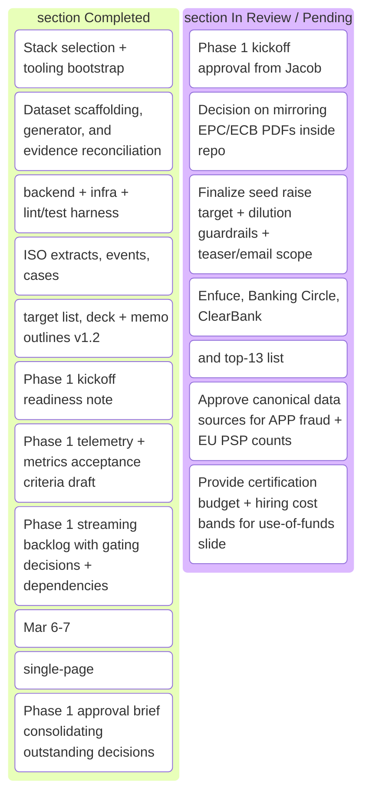

# Instant Payment Risk Mesh – Status Board

_Last updated: 2026-03-09 08:00 CET (Phase 1 approvals still pending; streaming core can start immediately once GO arrives)_

## Phase Overview
- **Current phase:** Phase 0 (Foundation) — ✅ deliverables packaged in `notes/phase0-evidence-pack.md`; all taskboard items validated and ready for sign-off.
- **Next phase:** Phase 1 (Streaming core) — approvals still pending for ISO 20022 ingestion, baseline rules engine, audit trail, telemetry, and demo instrumentation scope.
- **Today’s review (2026-03-09 08:00):** Re-ran BuildConductor checks; no new build work possible until approvals below are cleared, evidence pack + approval brief remain current.

### Blockers / Approvals
- **ACTION REQUIRED:** Approve the transition to Phase 1 so streaming-core tickets can be executed.
- **ACTION REQUIRED:** Decide whether EPC/ECB guideline PDFs can be mirrored inside the repo or must remain link-only (impacts ingestion fixtures + docs).
- **ACTION REQUIRED:** Confirm final seed raise target, acceptable dilution band, and whether to draft the investor teaser/email template now.
- **ACTION REQUIRED:** Approve/adjust the proposed design-partner PSP list (Enfuce, Banking Circle, ClearBank) and share existing relationships.
- **ACTION REQUIRED:** Provide warm intro owners for Northzone, EQT Ventures, and the remaining top-13 investors.
- **ACTION REQUIRED:** Approve canonical APP fraud + EU PSP data sources and share certification budget + hiring cost bands for the investor materials.
